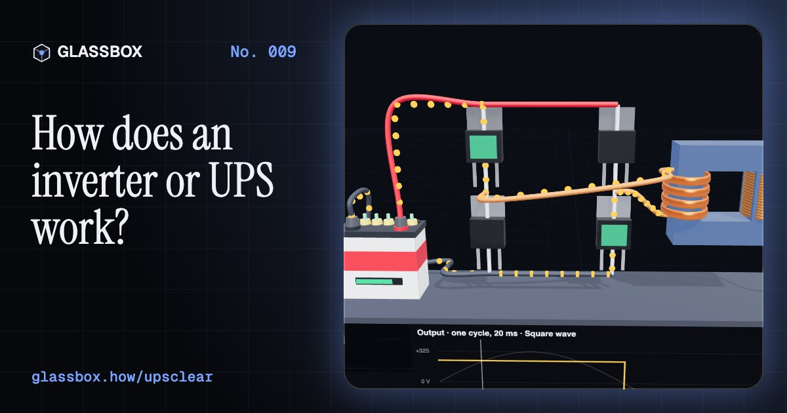
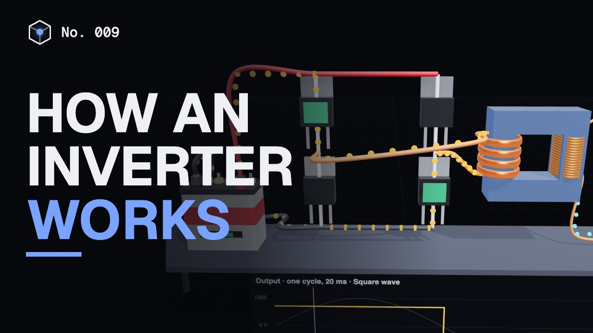
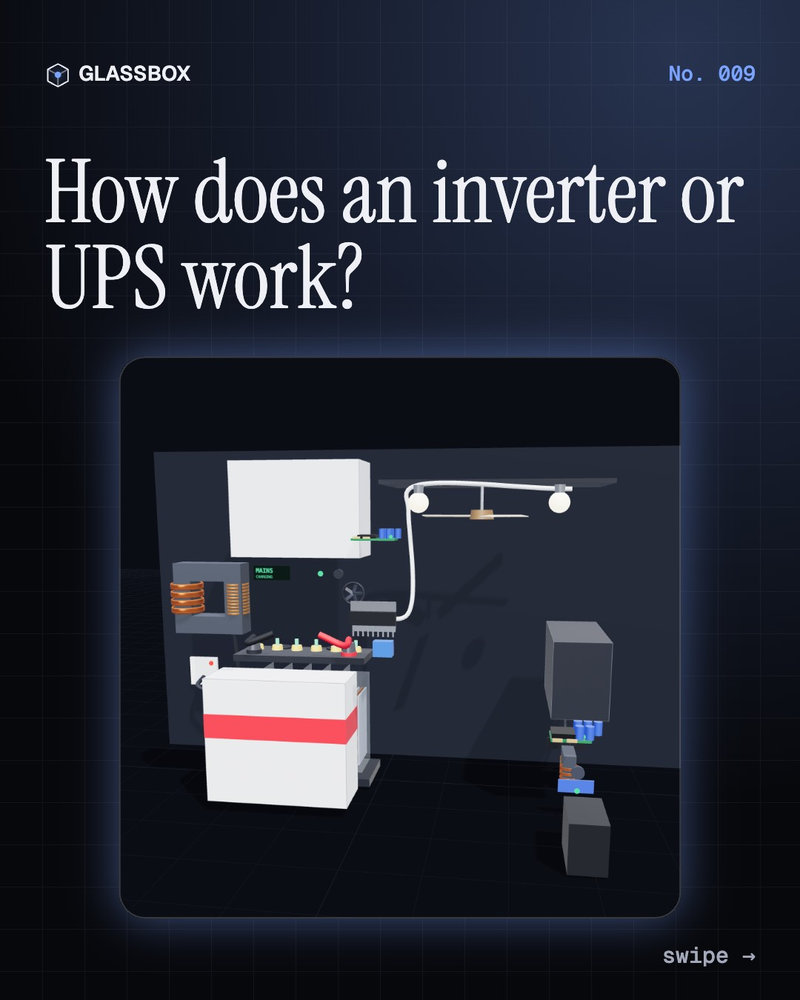
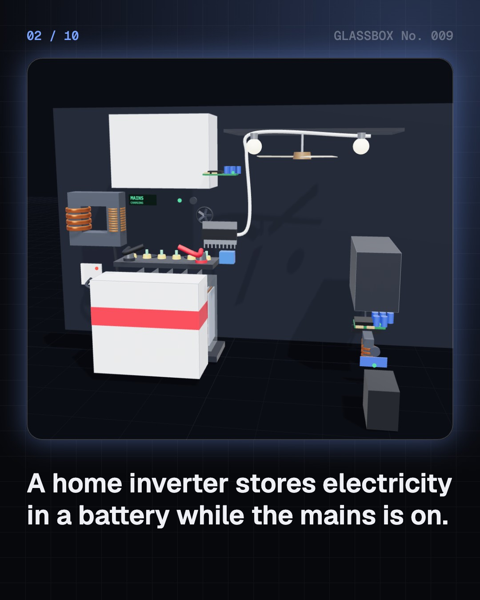
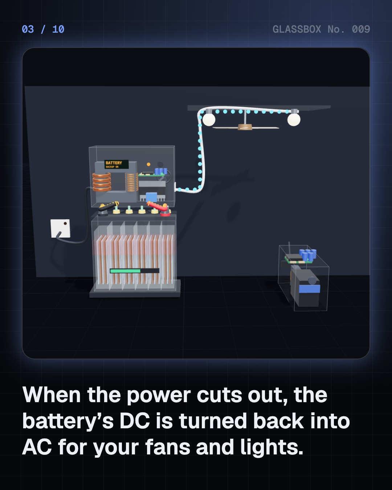
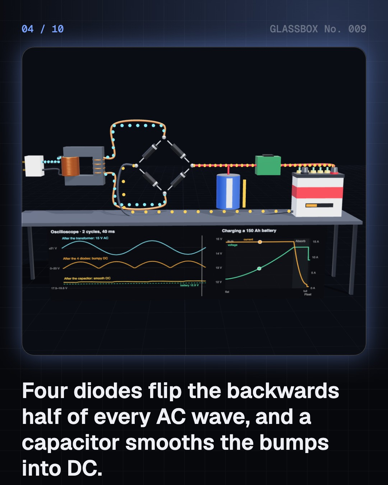

<!-- glassbox:start -->
<!-- Generated from glassbox.json by the Glassbox hub (npm run readme -- upsclear). Edit glassbox.json, not this block. -->
<p align="center"><a href="https://glassbox-production-fd52.up.railway.app/e/upsclear/"></a></p>

<h1 align="center">UPSClear</h1>

<p align="center"><b>How does an inverter or UPS work?</b><br>When the power cuts out and the fans keep turning, a box in the corner is quietly turning a battery's DC back into 230 V AC. Take a home inverter and a computer UPS apart in 3D, and watch the switch happen in milliseconds.</p>

<p align="center"><a href="https://glassbox-production-fd52.up.railway.app/upsclear/"><b>▶ Play with it</b></a> &nbsp;·&nbsp; <a href="https://glassbox-production-fd52.up.railway.app/e/upsclear/">Read the 60-second explainer</a> &nbsp;·&nbsp; <a href="https://glassbox-production-fd52.up.railway.app/upsclear/glassbox/reel.mp4">Watch the 40-second video</a></p>

<p align="center">
  <a href="https://glassbox-production-fd52.up.railway.app/e/upsclear/"></a>
  <a href="https://glassbox-production-fd52.up.railway.app/e/upsclear/"></a>
  <a href="LICENSE"></a>
  <a href="LICENSE-CONTENT.md"></a>
  <a href="#privacy"></a>
</p>

## In 60 seconds

1. **Store it now, give it back later.** A home inverter is a battery, a charger and an inverter in one box. While the mains is on it fills a 12 V battery; in a power cut it turns that battery's energy back into 230 V AC for your fans and lights. A computer UPS is the same idea, shrunk down.
2. **AC into DC: four diodes and a capacitor.** Mains in India swings between +325 V and −325 V fifty times a second. A transformer steps it down, a bridge of four diodes flips the backwards half of each wave, and a capacitor smooths the bumps. The charger then fills the battery in stages: bulk, about 14.4 V absorption, then about 13.5 V float.
3. **DC into AC: four switches and a transformer.** Four MOSFET switches in an H-bridge connect the battery one way round, then the other, 50 times a second. Pure sine inverters switch thousands of times a second in pulses of changing width and filter them smooth. A transformer with about 19 times more turns lifts 12 V to 230 V, and the current drops by the same factor.
4. **Switching over in milliseconds.** An offline UPS lets mains straight through and clicks a relay over to its inverter when the mains fails, in about 5 to 15 ms. A PC survives the gap on the capacitor inside its power supply. An online UPS runs from its inverter all the time, so there is no gap at all.
5. **How long the backup lasts.** 12 V × 150 Ah is 1,800 Wh, but only about 80% is usable, the inverter loses about 15%, and draining a battery fast gives less capacity (Peukert's law). Two ordinary fans, four LED bulbs, a TV and a router run for about three and a half hours; with BLDC fans, nearly six.
6. **Inside the battery.** Six lead-acid cells of about 2.1 V make 12.6 V. Discharging turns both plates into lead sulfate and weakens the acid, so a hydrometer reading shows the charge. Charging splits a little water, so it needs distilled water topped up. LiFePO₄ batteries use four 3.2 V cells, weigh about a third as much and last thousands of cycles.

## Words worth knowing

| Term | Meaning |
|---|---|
| **AC and DC** | Alternating current keeps reversing, 50 times a second in India; direct current flows one way, like a battery's. |
| **Rectifier** | A circuit, usually four diodes in a bridge, that turns AC into current flowing one way. |
| **Inverter** | A circuit that turns DC into AC by switching a battery's connection back and forth. |
| **H-bridge** | Four switches that can connect a load either way round to a battery. |
| **PWM** | Pulse-width modulation: fast on-off pulses whose changing widths average out to a smooth wave. |
| **Transformer** | Two coils on an iron core that step AC voltage up or down; the current changes the other way. |
| **Transfer time** | The gap between the mains failing and the backup taking over: about 10 ms for an offline UPS, zero for an online one. |
| **Amp-hour** | How much charge a battery holds. Volts × amp-hours gives the energy in watt-hours. |
| **Specific gravity** | The density of a lead-acid battery's acid compared with water: about 1.26 when full, 1.12 when flat. |

## A short history

**225 years from a stack of metal discs in Italy to the battery box that keeps India's fans turning when the power goes out.**

- **1800** · The first battery (Alessandro Volta, Como, Italy)
- **1859** · A battery you can recharge (Gaston Planté, Paris, France)
- **1888** · A motor for alternating current (Nikola Tesla and Galileo Ferraris, New York, USA, and Turin, Italy)
- **1896** · Niagara lights Buffalo (Westinghouse, using Tesla's AC system, Niagara Falls to Buffalo, New York, USA)
- **1947** · The transistor (John Bardeen, Walter Brattain and William Shockley, Bell Labs, Murray Hill, New Jersey, USA)
- **1957** · The thyristor (Gordon Hall, Frank W. ‘Bill’ Gutzwiller and General Electric, Clyde, New York, USA)
- **1969** · A silent UPS for a computer (Fuji Electric, Matsumoto and Kawasaki, Japan)
- **1991** · Lithium-ion goes on sale (Sony, Japan)

The full story, with 29 moments, charts, people and 51 sources: [glassbox.how/e/upsclear/history](https://glassbox-production-fd52.up.railway.app/e/upsclear/history/). The data lives in [`history.json`](history.json).

## Video and slides

Made with the Glassbox studio from this box's storyboard (`window.glassbox.director`). Free to reuse under CC BY 4.0.

<a href="https://glassbox-production-fd52.up.railway.app/upsclear/glassbox/video.mp4"></a>

<p><a href="glassbox/slide-1.jpg"></a> <a href="glassbox/slide-2.jpg"></a> <a href="glassbox/slide-3.jpg"></a> <a href="glassbox/slide-4.jpg"></a></p>

| File | What | Size |
|---|---|---|
| [`glassbox/reel.mp4`](https://glassbox-production-fd52.up.railway.app/upsclear/glassbox/reel.mp4) | Reel / Short, with captions and soundtrack | 1080×1920 |
| [`glassbox/video.mp4`](https://glassbox-production-fd52.up.railway.app/upsclear/glassbox/video.mp4) | YouTube video, with captions and soundtrack | 1920×1080 |
| `glassbox/slide-1…10.jpg` | Instagram carousel | 1080×1350 |
| `glassbox/thumb.jpg` | YouTube thumbnail | 1280×720 |
| `glassbox/cover.jpg` | Share card and repo social preview | 1200×630 |
| [`glassbox/history-reel.mp4`](https://glassbox-production-fd52.up.railway.app/upsclear/glassbox/history-reel.mp4) | “History in 10 moments” Reel / Short | 1080×1920 |
| `glassbox/history-slide-*.jpg` | History carousel | 1080×1350 |
| `glassbox/post.json` | Post copy and schedule used by the publish kit | |

## Privacy

This box has no accounts and no ads, and it ships its own fonts and libraries. When you run it yourself it sends nothing anywhere. On glassbox.how, the site's `/bar.js` also loads Glassbox's analytics: **Google Analytics** to count visits (it asks first in the EU, UK and Switzerland, and stays off when your browser sends Global Privacy Control or Do Not Track) and **ClickTrust** to detect bots.

It remembers a few things **in your own browser only**, and never sends them anywhere:

| Browser storage key | What it holds |
|---|---|
| `upsclear.v1` | Which chapters you have opened, your best quiz scores, and sound on or off. |

Exactly what each one sees is at [glassbox.how/privacy](https://glassbox-production-fd52.up.railway.app/privacy/).

## Licences

- **Code:** [MIT](LICENSE). Use it, change it, ship it.
- **Explanations, text, images and videos** (`glassbox.json`, `glassbox/`): [CC BY 4.0](LICENSE-CONTENT.md). Credit “Glassbox, glassbox.how/e/upsclear”.
- **Third-party parts** keep their own licences: [three.js](https://threejs.org) (MIT), [Geist, Instrument Serif](https://openfontlicense.org) (SIL OFL 1.1).
- The Glassbox name and logo aren't covered by either licence. See the [terms](https://glassbox-production-fd52.up.railway.app/terms/).

Found a mistake? [Open an issue](https://github.com/bdeeps/upsclear/issues). Corrections happen in public.
<!-- glassbox:end -->

## Run it

It's plain HTML, CSS and JavaScript. No build step and no dependencies. Run locally, it contacts no other website.

```bash
python3 -m http.server 8000
```

Three.js and the fonts ship in `vendor/` and `fonts/`, so it also works offline.

Then open http://localhost:8000.

## How it's built

| File | What |
|---|---|
| `index.html`, `css/app.css` | The page and its styles |
| `js/app.js`, `js/stage.js`, `js/ui.js`, `js/kit.js` | The shared Glassbox 3D engine: chapters, 3D stage, controls, quiz, video director |
| `js/chapters/*.js` | One file per chapter: the 3D model, controls, text, key terms, quiz and video scenes |
| `js/ups.js` | UPSClear's shared physics and parts: mains and battery numbers, the backup-time model, lead-acid and LiFePO₄ cell voltages, inverter waveforms, and 3D models of a home inverter, a tubular battery, a computer UPS, a relay, a transformer and the things they power |
| `glassbox.json` | Title, question, explainer beats, key terms, browser storage and credits shown on glassbox.how |
| `reel` in each chapter | The storyboard the Glassbox studio records into short videos |
| `glassbox/` | The published video, slides, thumbnail and post copy |
| `fonts/`, `vendor/three/` | Self-hosted Geist and Instrument Serif (SIL OFL 1.1) and three.js (MIT) |
